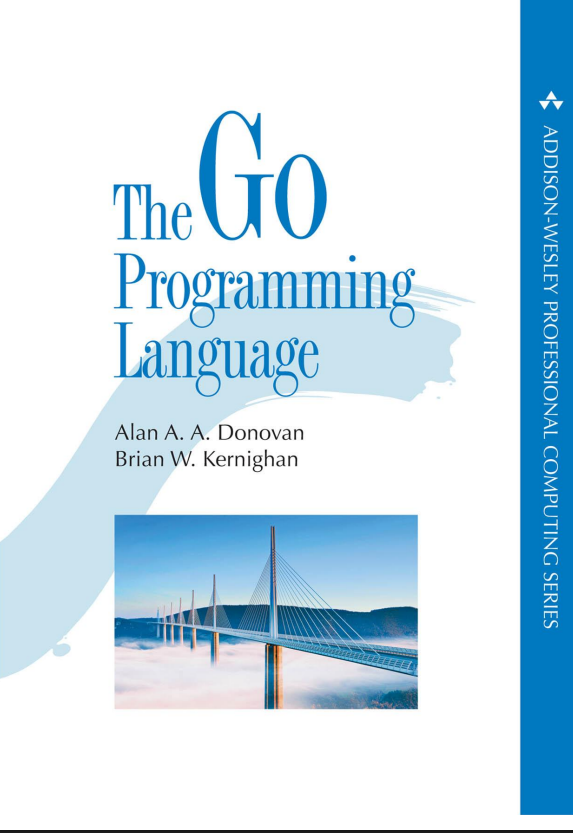

these are my notes on the go programming language book by kernighan and other authors.

still very wip at the moment.

[notes.md](notes.md) for verbose and rough notes

examples under the exercises-and-examples directory, imgs are just a place to store the images.
