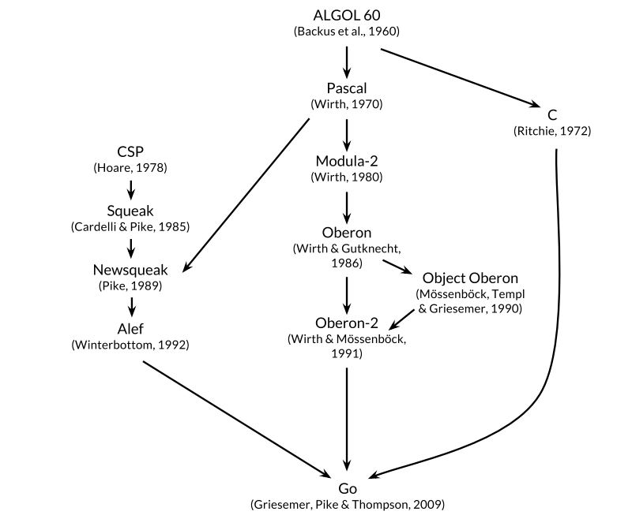
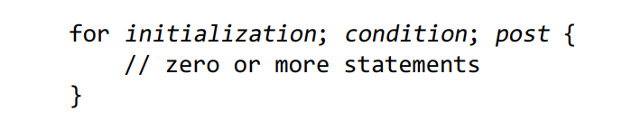

I started this book because I want to have an idiomatic understanding of how to write go code.

for the rest of my notes I will refer to Kernighan as k, because of k&r

> [!NOTE]
> the book has a way to download the examples using go get, for learning purposes I hand-coded all of the examples and put them under the `./exercises-and-examples/` directory.

## preface

to quote the book, first page talks about how go's approach to data abstraction and object oriented programming is unusually flexible. It also states that it is garbage collected, to no suprise of mine and boldly states that it borrows the good features of other languages and has omitted the features which have led to complexity and unreliable code.

the book also states that it is well suited for writing networked servers, tools and systems for programmers. but then it states that it is a great _general purpose_ language, suited well for any a task an untyped scripting language might perform. I completely agree with this, it is the reason why MERN bro -> go swe is quite a popular transition. for k to be able to note this and express this in 2015 is a great testament to the way go aged so well.

> [!NOTE]
> the book mentioned [plan 9](https://en.wikipedia.org/wiki/Plan_9_from_Bell_Labs) (the os) and I had to go and research that. It's basically an operating system that expands upon unix's philosophy of "everything is a file descriptor" to the network and devices themselves also. it is built from the ground up to be easily distributed and features a distributed file system as a consequence.

im glad the first pages of this book say this:

> This book is meant to help you start using Go effectively right away and to use it well, taking full advantage of Go’s language features and standard libraries to write clear, idiomatic, and efficient programs.

exactly what I wanted.

### the origins of go

successful languages create offspring that take on the advantages of their creator.

the book states that by viewing the ancestors of a programming language one can see for what it exists in the first place.



go is described as the 21st century C by some people.
it takes inspiration from c because of its:

- expression syntax ->
- control flow statements -> if, else, switch, for, while, break, return, continue
- it recieving copies of values when passing in values to a function instead of the direct pointer unless explicitly stated. go also has pointers
- and it being _heavily_ inspired by C's ability to compile down to heavily efficient machine code and _naturally build on top of the operating systems own primitives_
  ^ I love this feature of go. it is one of the main things that pull me to this language.

there are other ancestors in go's family tree though, Nikolas Wirth's family of languages,

pascal till oberon 2 inspired go's package, module and interface design.

my favourite branch within this tree though is the one which comes from CSP.

CSP, standing for communicating sequential processes, is go's favored pattern for concurrency.

as per Hoare's original definition, in CSP a program is a collection of processes that share no state and are executed in parallel. the way they communicate is by using _channels_ to send messages to each other.

Rob pike and the team at bell labs began experimenting with actually implementing CSP in a programming language. Thsi resulted in squeak, and then newsqueak, which was C-like. The word squeak comes from the fact that the programming language was there to talk with the mouse and keyboard.

The Alef programming language expanded upon these languages and was created for the plan 9 operating system, but it was too painful to use because of its manual memory management paired with concurrency.

## the go project

heavily argues for simplicity. go was born of a need for simplicity in google.

> Only through
> simplicity of design can a system remain stable, secure , and coherent as it grows.

---

But it has comp arat ive lyfew featuresand isunlikely to add
more . Fo r inst ance, ithas noimp licitnumer ic conv ersions, no con str uctor s or destr uctor s,no
op erator overloading, nodefau ltparameter values, noinher itance, nogener ics, no exception s,
no macros, nofunctionannot ation s,and no thread-lo cal storage

> [!WARNING]
> study this deeper

---

go has a simple type system and offers backwards compatability with all of its other versions. the tooling also focuses on minimal config and ease of use.

### organization of the book

I love how Kernighan talks about go as a programming language which can do object oriented programming language.

> Go has an unusualappro ach to obj e ct-oriente d prog ramming. There are noclass hierarchies,
> or indeed any class es; comp lex obj e ctbeh avior s arecre ate d from simpler ones by composition,
> notinher itance. Met hodsmay beass oci ated wit h anyuser-define d type,not juststr uctures,
> andthe rel ation shipbet weencon crete typ es andabstrac t types(interfaces) is imp licit, soa
> concrete typ e maysat isf y an interface thatthe typ e’sdesig ner was unawareof. Met hodsare
> covere d in Chapt er6and int erfaces in Chapt er7.

acknowledgements were nice.

now, onto the actual...

---

## 1. tutorial

### 1.1 Hello, world

- package main is special, import is for importing, function main is what the program does, there cant be unused vars and imports for space saving and maintainability reasons.
- go encourages automatic formatting via `gofmt` to get rid of bike shedding and allow ease of parsing the language. This allows other tools to operate on go code easily because they can assume one form of formatting.
  - > automated source code transformations that would be infeasible if arbitrary formatting were allowed.

### 1.2 Command-Line arguments

- `os.Args` is the way you get your arguments from the OS. first item in the string[] slice is the name of the process itself, while the subsequent is whatever you write after the binaries name. `./program (args[0]) arg (args[1]) arg arg`
- indexing with arrays is like any other language. slices also have subsequences in the form of s\[n:m\].
  first index incldued last index excluded.

example implementations and exercises of the unix `echo` command, including my own, can be seen under `./exercises-and-examples/1.2-command-line-arguments/`

- package level comments are usually placed right before the package declaration. My lazyvim + my lsp render the documentation when clicking shift+k on any stdlib module.

#### **examples:**

the way the code works is it's just a loop which concats the args together into one string variable named s, interestingly though the book calls this process computationally expensive as it is _quadratic_.

I chatgpt'd what the book meant by quadratic, and what it was trying to say is basically everytime you add a space to the string, it needs to create a copy of the all the characters in the string. so with n arguments, there has to be n^2 operations done.

This doesn't really matter in the case of echo though because you wont be chaining multiple very long strings together as args.

Then it goes on to talk about how for loops are in go. theres only one type of expression for creating loops in go, being `for`.

`for`, has 3 possible components:



all components of the for loop are optional, and an empty `for {}` statement simply executes what is inside the braces forever. Much like a traditional while loop, it can be broken by returning or using the keyword `break`

the initialization, which is a local initialization of a variable to be used within the for loop, especially common for error handling cases where the function does nothing but return an error. This allows for the error variable to be defined locally only within the if statement that handles it.

Condition and post are self explanatory. Think C.

example:

```go
json := []byte(`{"age": 18, "role": "swe", "org": "azercell"}`)
var data map[string]any

if err := json.Unmarshal(json, &data); err != nil {
  // log writes to stderr instead of stdin, making it a better default for error handling
  log.Println("could not assign json to the data object, malformed input")

}
```

> [!NOTE]
> this example was inspired by [go by example's json section](https://gobyexample.com/json)

there are 2 ways to declare a variable:

- a short variable declatation -> i.e s := ""
- or the long form which is var s string, the second one relies on the implicit default value of strings being ""

I actually lied btw. You can also declare variables with var s = "" (which is rarely used unless you're declaring multiple variables) or with var s string = "" (which is redundnat unless the type of the variable is different than what it is inferred as, most prominently seen when setting an int of a certain size, i.e int48)

#### **exercises**

Exercises 1.1 and 1.2 are super easy. Just change the range to start from 0 instead of 1.

Exercise 1.3 on the other hand was fun. xxxxxx (TODO: fill in)

While implementing this I learned about:

time.Parse (which takes in a layout string, either as a constant from the [time library](https://pkg.go.dev/time) or as a handwritten example, and the time string itself to construct a time variable. [See the stdlib for more details](https://pkg.go.dev/time#Parse))

And the Format method on a variable of type time.Time. Which is returns a string.

Also time.Duration is beautifully simple, its just an int64 of nanoseconds. That's why you can minus one from another.
